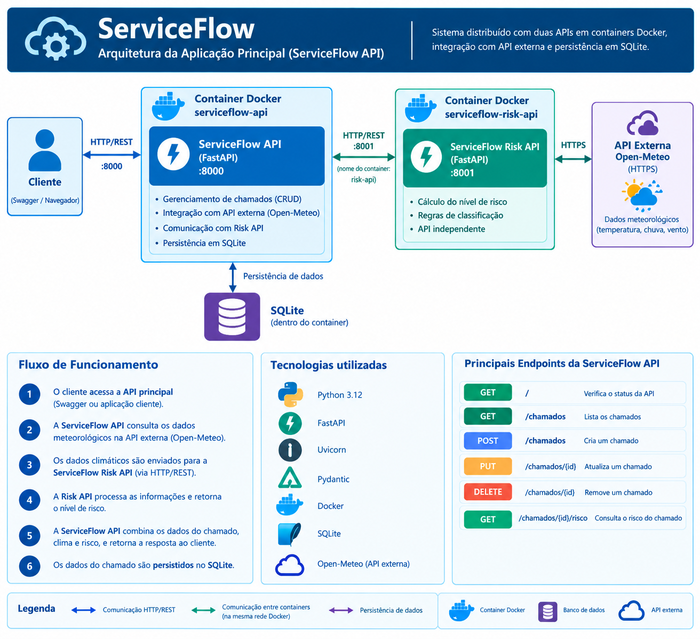

# ServiceFlow API

API REST principal do **ServiceFlow**, um sistema distribuído para gerenciamento de chamados de serviços técnicos externos e avaliação de risco climático para a realização desses atendimentos.

A aplicação permite cadastrar, consultar, atualizar e excluir chamados técnicos, além de consultar as condições meteorológicas da localização do atendimento e obter uma classificação de risco por meio de uma API secundária especializada.

O projeto foi desenvolvido como um MVP acadêmico baseado no conceito de **componentização e comunicação entre serviços independentes utilizando REST**.

---

## 🎯 Objetivo

O ServiceFlow foi desenvolvido para auxiliar empresas que realizam atendimentos técnicos externos.

Antes de enviar um técnico para determinado atendimento, o sistema pode consultar as condições meteorológicas previstas para a localização do chamado e avaliar se existem condições climáticas que possam dificultar a execução do serviço.

A solução permite:

- Cadastrar chamados técnicos;
- Consultar chamados cadastrados;
- Atualizar informações dos chamados;
- Excluir chamados;
- Consultar condições meteorológicas;
- Avaliar o risco climático de um atendimento;
- Integrar diferentes componentes por meio de HTTP/REST;
- Persistir os chamados utilizando SQLite.

---

# 🏗️ Arquitetura

O ServiceFlow é composto por três componentes:

1. **ServiceFlow API** — API principal desenvolvida em FastAPI;
2. **ServiceFlow Risk API** — API secundária responsável pela classificação do risco;
3. **Open-Meteo** — API externa utilizada para obtenção dos dados meteorológicos.

A persistência dos chamados é realizada utilizando **SQLite**.



### Fluxo principal

```text
Cliente / Swagger
       │
       │ HTTP/REST
       ▼
┌─────────────────────────┐
│    ServiceFlow API      │
│        :8000            │
│                         │
│ FastAPI + SQLite        │
└───────┬─────────┬───────┘
        │         │
        │         │ HTTPS
        │         ▼
        │   ┌───────────────┐
        │   │  Open-Meteo   │
        │   │ API externa   │
        │   └───────────────┘
        │
        │ HTTP/REST
        ▼
┌─────────────────────────┐
│ ServiceFlow Risk API    │
│        :8001             │
│                         │
│ Cálculo do risco        │
└─────────────────────────┘
```

---

# 🔄 Fluxo de consulta de risco

Quando o cliente solicita:

```text
GET /chamados/{id}/risco
```

a ServiceFlow API executa o seguinte fluxo:

```text
1. Localiza o chamado no SQLite
              ↓
2. Obtém latitude e longitude
              ↓
3. Consulta a API Open-Meteo
              ↓
4. Obtém dados meteorológicos
              ↓
5. Envia os dados para a ServiceFlow Risk API
              ↓
6. A Risk API calcula o nível de risco
              ↓
7. A ServiceFlow API combina as informações
              ↓
8. Retorna o resultado ao cliente
```

Dessa forma, o cliente não precisa acessar diretamente a API externa nem a API secundária.

---

# 🛠️ Tecnologias utilizadas

- Python 3.12
- FastAPI
- Uvicorn
- SQLAlchemy
- Pydantic
- HTTPX
- SQLite
- Docker
- Open-Meteo API

---

# 📁 Estrutura do projeto

```text
serviceflow-api/
│
├── app/
│   ├── __init__.py
│   ├── main.py
│   ├── database.py
│   ├── models.py
│   ├── schemas.py
│   ├── crud.py
│   │
│   └── services/
│       ├── __init__.py
│       ├── risk_service.py
│       └── weather_service.py
│
├── docs/
│   └── architecture.png
│
├── tests/
│
├── .gitignore
├── Dockerfile
├── README.md
└── requirements.txt
```

### Responsabilidade dos principais arquivos

**`app/main.py`**

Define a aplicação FastAPI e os endpoints disponibilizados pela API principal.

**`app/database.py`**

Configura a conexão com o banco de dados SQLite utilizando SQLAlchemy.

**`app/models.py`**

Define o modelo persistido no banco de dados.

**`app/schemas.py`**

Define os modelos de entrada e saída da API utilizando Pydantic.

**`app/crud.py`**

Concentra as operações de criação, consulta, atualização e exclusão dos chamados.

**`app/services/weather_service.py`**

Responsável pelo consumo e tratamento dos dados retornados pela API Open-Meteo.

**`app/services/risk_service.py`**

Responsável pela comunicação HTTP com a ServiceFlow Risk API.

---

# 🚀 Instalação e execução local

## Pré-requisitos

- Python 3.12 ou superior;
- pip;
- Git.

Para execução em containers:

- Docker Desktop ou Docker Engine.

---

## 1. Clone o repositório

```bash
git clone https://github.com/pedrossjr/puc-rio-mvp-service-flow-api.git
```

Entre no diretório:

```bash
cd serviceflow-api
```

---

## 2. Crie o ambiente virtual

No Windows:

```powershell
python -m venv .venv
```

Ative o ambiente:

```powershell
.venv\Scripts\activate
```

---

## 3. Instale as dependências

```bash
pip install -r requirements.txt
```

---

## 4. Execute a ServiceFlow Risk API

A API principal depende da ServiceFlow Risk API para realizar o cálculo de risco.

Em outro terminal, dentro do projeto `serviceflow-risk-api`:

```bash
uvicorn app.main:app --reload --port 8001
```

---

## 5. Execute a ServiceFlow API

No projeto principal:

```bash
uvicorn app.main:app --reload --port 8000
```

A API estará disponível em:

```text
http://127.0.0.1:8000
```

---

# 📚 Documentação da API

O FastAPI fornece documentação automática.

### Swagger UI

```text
http://127.0.0.1:8000/docs
```

### ReDoc

```text
http://127.0.0.1:8000/redoc
```

O Swagger pode ser utilizado para testar todos os endpoints da aplicação.

---

# 🔌 Endpoints

A ServiceFlow API possui os seguintes endpoints:

| Método | Rota                   | Descrição                  |
| ------ | ---------------------- | -------------------------- |
| GET    | `/`                    | Verifica o status da API   |
| GET    | `/chamados`            | Lista os chamados          |
| GET    | `/chamados/{id}`       | Consulta um chamado        |
| POST   | `/chamados`            | Cria um chamado            |
| PUT    | `/chamados/{id}`       | Atualiza um chamado        |
| DELETE | `/chamados/{id}`       | Remove um chamado          |
| GET    | `/chamados/{id}/risco` | Consulta o risco climático |

A aplicação possui operações utilizando os métodos **GET, POST, PUT e DELETE**, atendendo ao requisito de implementação de uma API REST com os diferentes métodos HTTP.

---

# GET `/`

Verifica o status da aplicação.

### Resposta

```json
{
  "aplicacao": "ServiceFlow API",
  "status": "online"
}
```

---

# GET `/chamados`

Retorna todos os chamados cadastrados.

### Exemplo de resposta

```json
[
  {
    "id": 1,
    "cliente": "Empresa Alfa",
    "servico": "Manutenção de equipamento",
    "cidade": "Rio de Janeiro",
    "latitude": -22.9068,
    "longitude": -43.1729,
    "data_agendada": "2026-09-06",
    "status": "ABERTO",
    "created_at": "2026-09-06T12:00:00"
  }
]
```

---

# GET `/chamados/{id}`

Consulta um chamado específico.

Exemplo:

```text
GET /chamados/1
```

Caso o chamado não exista, a API retorna HTTP `404`.

---

# POST `/chamados`

Cria um novo chamado técnico.

### Requisição

```json
{
  "cliente": "Empresa Alfa",
  "servico": "Manutenção de equipamento",
  "cidade": "Rio de Janeiro",
  "latitude": -22.9068,
  "longitude": -43.1729,
  "data_agendada": "2026-09-06"
}
```

### Resposta

A API retorna o chamado criado, incluindo seu identificador, status e data de criação.

O status inicial é:

```text
ABERTO
```

---

# PUT `/chamados/{id}`

Atualiza as informações de um chamado.

Exemplo:

```text
PUT /chamados/1
```

### Requisição

```json
{
  "status": "EM_ATENDIMENTO"
}
```

Os campos enviados são atualizados no registro existente.

---

# DELETE `/chamados/{id}`

Remove um chamado.

Exemplo:

```text
DELETE /chamados/1
```

Quando o chamado existe, a operação retorna HTTP `204`.

Caso contrário, retorna HTTP `404`.

---

# GET `/chamados/{id}/risco`

Consulta o risco climático associado ao chamado.

Esse é o principal recurso adicional da aplicação além do CRUD.

Exemplo:

```text
GET /chamados/1/risco
```

A API consulta as coordenadas cadastradas no chamado e obtém os dados meteorológicos através da Open-Meteo.

Depois, os dados são enviados para a ServiceFlow Risk API para classificação.

### Exemplo de resposta

```json
{
  "chamado": 1,
  "cliente": "Empresa Alfa",
  "servico": "Manutenção de equipamento",
  "cidade": "Rio de Janeiro",
  "clima": {
    "temperatura": 25.4,
    "chuva": 40,
    "vento": 32.1
  },
  "risco": {
    "nivel_risco": "MEDIO",
    "motivo": "Condições climáticas que exigem atenção.",
    "recomendacao": "Manter o atendimento com atenção às condições locais."
  }
}
```

---

# 🌦️ API externa — Open-Meteo

O ServiceFlow utiliza a **Open-Meteo** como serviço externo para obtenção de dados meteorológicos.

A Open-Meteo disponibiliza uma API de previsão meteorológica em formato JSON e permite utilização sem API Key para o uso gratuito não comercial.

## Cadastro

Não é necessário realizar cadastro ou fornecer API Key para o uso gratuito não comercial utilizado neste projeto.

## Endpoint utilizado

A aplicação utiliza o endpoint:

```text
GET https://api.open-meteo.com/v1/forecast
```

O endpoint recebe, entre outros parâmetros, latitude e longitude e permite solicitar variáveis meteorológicas específicas.

### Parâmetros utilizados pelo ServiceFlow

```text
latitude
longitude
current=temperature_2m,precipitation,wind_speed_10m
hourly=precipitation_probability
forecast_days=1
timezone=auto
```

A aplicação utiliza os seguintes dados:

| Dado                        | Utilização             |
| --------------------------- | ---------------------- |
| `temperature_2m`            | Temperatura atual      |
| `precipitation_probability` | Probabilidade de chuva |
| `wind_speed_10m`            | Velocidade do vento    |

A consulta é realizada pela aplicação e os dados retornados são processados internamente. O usuário não é redirecionado para a Open-Meteo, atendendo ao requisito de consumo e tratamento da API externa dentro da própria aplicação.

## Licença e condições de uso

Os dados disponibilizados pela Open-Meteo são distribuídos sob **CC BY 4.0**, sendo necessária atribuição adequada. O serviço gratuito é destinado ao uso não comercial e possui limites de utilização.

Para este projeto acadêmico, a utilização é feita dentro do contexto educacional.

**Fonte:** Open-Meteo — https://open-meteo.com/

---

# 🔗 ServiceFlow Risk API

A ServiceFlow API comunica-se com a API secundária:

```text
ServiceFlow Risk API
http://serviceflow-risk-api:8001
```

Quando executada localmente fora de containers, o endereço padrão utilizado é:

```text
http://localhost:8001
```

Quando executada em Docker, a variável de ambiente `RISK_API_URL` permite informar o endereço da API secundária.

Exemplo:

```text
RISK_API_URL=http://serviceflow-risk-api:8001
```

---

# 🐳 Execução com Docker

O projeto possui um `Dockerfile` próprio.

## Construir a imagem

Na raiz do projeto:

```bash
docker build -t serviceflow-api .
```

## Criar a rede Docker

```bash
docker network create serviceflow-network
```

## Executar a Risk API

```bash
docker run -d \
  --name serviceflow-risk-api \
  --network serviceflow-network \
  -p 8001:8001 \
  serviceflow-risk-api
```

## Executar a ServiceFlow API

```bash
docker run -d \
  --name serviceflow-api \
  --network serviceflow-network \
  -p 8000:8000 \
  -e RISK_API_URL=http://serviceflow-risk-api:8001 \
  serviceflow-api
```

No PowerShell do Windows, os comandos podem ser executados em uma única linha caso desejado.

---

# 🔍 Verificar os containers

```bash
docker ps
```

Os dois containers deverão estar em execução:

```text
serviceflow-api
serviceflow-risk-api
```

A documentação da API principal estará disponível em:

```text
http://127.0.0.1:8000/docs
```

---

# 🗄️ Persistência

A aplicação utiliza **SQLite** através do SQLAlchemy.

O banco é criado automaticamente pela aplicação utilizando:

```text
serviceflow.db
```

A estrutura da tabela principal é baseada no modelo `Chamado`.

Os dados persistidos incluem:

- Identificador;
- Cliente;
- Serviço;
- Cidade;
- Latitude;
- Longitude;
- Data agendada;
- Status;
- Data de criação.

---

# 🧪 Exemplo de utilização

### 1. Criar um chamado

```text
POST /chamados
```

```json
{
  "cliente": "Empresa Alfa",
  "servico": "Manutenção de equipamento",
  "cidade": "Rio de Janeiro",
  "latitude": -22.9068,
  "longitude": -43.1729,
  "data_agendada": "2026-09-06"
}
```

### 2. Consultar o chamado

```text
GET /chamados/1
```

### 3. Consultar o risco

```text
GET /chamados/1/risco
```

### 4. Resultado

O ServiceFlow consulta a Open-Meteo, envia os dados climáticos para a Risk API e retorna o resultado consolidado.

---

# 🧩 Componentização

A solução foi organizada em componentes independentes:

```text
ServiceFlow
│
├── ServiceFlow API
│   ├── Gerenciamento dos chamados
│   ├── Persistência SQLite
│   └── Integração com serviços externos
│
├── ServiceFlow Risk API
│   └── Classificação de risco climático
│
└── Open-Meteo
    └── Dados meteorológicos
```

Cada componente desenvolvido possui seu próprio repositório público e seu próprio `Dockerfile`, conforme solicitado no projeto.

---

# 📌 Diferenciais da solução

Além das operações CRUD, a aplicação implementa uma funcionalidade específica para o domínio escolhido:

**Avaliação automática de risco climático para chamados técnicos externos.**

Essa funcionalidade envolve:

- consumo de serviço externo;
- processamento dos dados recebidos;
- comunicação entre APIs;
- regras de negócio em componente independente;
- persistência das informações;
- execução dos componentes em containers Docker.

O domínio de gestão de serviços técnicos externos foi escolhido de forma distinta dos cenários de exemplo apresentados no enunciado. O requisito de criatividade solicita justamente aplicação dos componentes em domínio diferente dos exemplos e funcionalidades adicionais além do CRUD básico.

---

# 👨‍💻 Autor

**Pedro Silva**

Projeto acadêmico - Engenharia de Software
PUC-Rio
